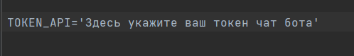
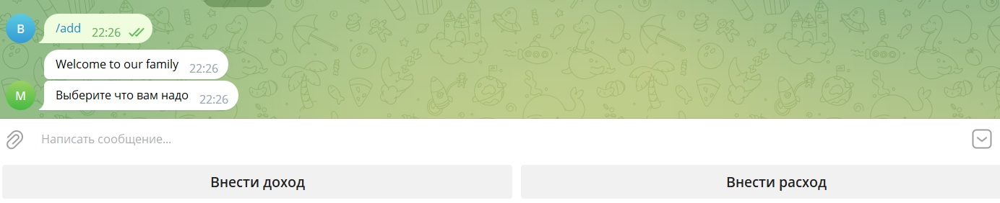
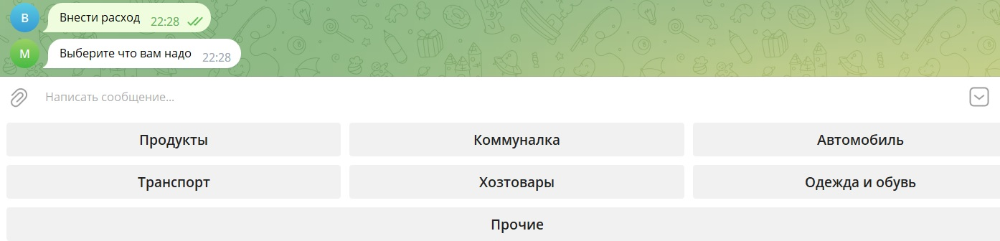
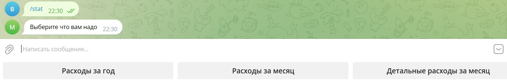
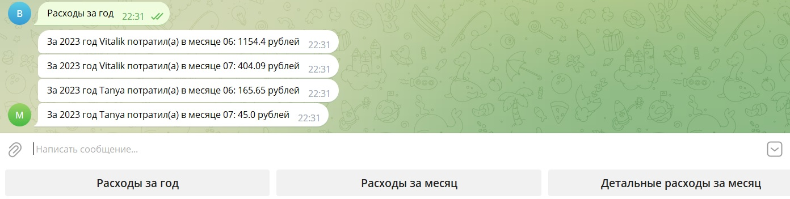
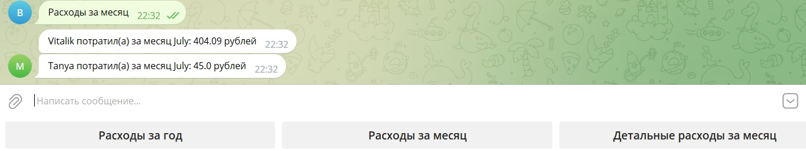
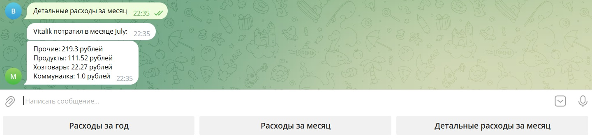

<!DOCTYPE html>
<html lang="ru">
<head>
  <meta charset="UTF-8">
  <meta http-equiv="X-UA-Compatible" content="IE=edge">
  <meta name="viewport" content="width=device-width, initial-scale=1.0">
  <title>Readme.md</title>
  <link rel="stylesheet" href="CSS/style.css">
  <link rel="stylesheet" href="CSS/normalize.css">
</head>
<body>
  

    <h1 class="title">
      Телеграмм бот версия 0.1.4
    </h1>
    

        Данный телеграмм бот учет семейного бюджета.
    

    <h2>
        Список команд телеграмм бота:
    </h2>
        <ul>
        <li><a href="#p1">/user</a></li>
        <li><a href="#p2">/add</a></li>
        <li><a href="#p3">/stat</a></li>
        </ul>
    <h3 id="p1"> Команда /user</h3>
        
 После ввода запрашивает ввести имя пользователя и записывает его в базу

    <h3 id="p2"> Команда /add</h3>
        
 После ввода запрашивает выбор действия внести расход или доход. После вносит в базу полученную информацию

    <h3 id="p3"> Команда /stat</h3>
        
 После ввода запрашивает выбор действия: (расходы за год, расходы за текущий месяц, детальные расходы за месяц). 
            После выводит информацию об общих расходах за выбранный период по пользователям

    <h2>    
        Обновления
    </h2>
        

            
 Версия 0.1.1

            
 Расширена команда /add (добавлена возможность внесения дохода) и добавлена команда /mount

        

        

            
 Версия 0.1.2

            
 Заменена команда /mount на команду /stat и расширены ее возможности

        

        

            
 Версия 0.1.3

            
 расширены возможности команды /stat (добавлены расходы по категориям для юзера)

        

        

            
 Версия 0.1.4

            
 добавлены категории расходов: "Здоровье", "Дети"

        

    <h2>    
        Установка
    </h2>
        
Скопируйте с репозитория в выбранную директорию. Создайте файл .env куда внесите токен бота.

        
  

    

        <h2>    
            Примеры работы бота
        </h2>
            
            
            
            
            
            
    

        
</body>
"# TG_bot_Family_cash" 

